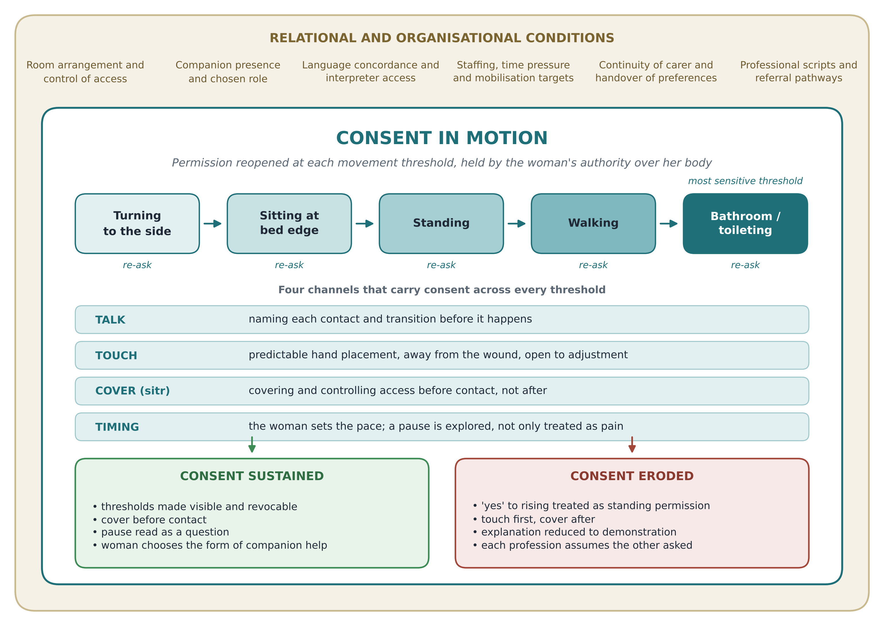

> **Exemplar note (remove before any submission).** This Findings section is a teaching exemplar written to match the study design reported in Sections 1–6. The participant codes, interpretations and quotations are **constructed for illustration**. They are not real participant data. In a real manuscript, every quotation must come verbatim (or as a checked translation) from the study transcripts, and the themes must come from the analysis audit trail. Use this text as a model of structure, depth, voice and analytic logic, not as content to report.

---

## 7. Findings

### 7.1 Overview of the conceptual account

The 21 accounts, from 11 women, six nurses and four physiotherapists, supported one overarching interpretation, which we call ***consent in motion***. Participants did not describe permission for hands-on assistance during early mobilisation as a single agreement given at the bedside before the woman got up. Women experienced it, and professionals at their best enacted it, as a series of small authorisations. Each one was reopened at a *movement threshold*: rolling to the side, sitting on the edge of the bed, standing, walking and, most sharply, entering the bathroom. At each threshold the hands, the parts of the body involved, the degree of exposure and the people who could see her changed. Consent was carried through four interlinked channels: **talk** (naming what would happen), **touch** (how and where hands were placed), **cover** (*sitr*, keeping the body covered) and **timing** (whether the woman set the pace). Consent was sustained when professionals made each threshold visible and gave the woman a way to stop. It eroded when her agreement to the *goal* of getting up was treated as standing permission for every contact and every exposure that followed.

Three themes, each with three subthemes, make up this account (Table 2). The first theme describes the *layered structure* of permission. The second describes how bodily privacy was protected, or exposed, through covering, shared space and companions. The third describes the clinical, relational and organisational *conditions* that made it possible, or not, for a woman to pause, adjust or decline. Following Interpretive Description's commitment to knowledge that clinicians can use,19,21 and consistent with recent methodological work that applied the approach to integrate patient, family and nurse perspectives on a bedside intervention in critical care,26 we present the themes as a single practice-oriented account rather than separate group summaries. Differences between women's experiences and professional reasoning are reported where they appeared, because they were often the most useful findings for practice.

Women's quotations were translated from Arabic. Professional quotations marked [E] were spoken in English. Ellipses in square brackets […] mark omitted text. Other square brackets add clarifying context or interactional features from field notes. Participant codes give group (W = woman, N = nurse, PT = physiotherapist) and context relevant to the interpretation. For example, *W03, emergency, general anaesthesia, shared room* identifies a woman, and professional codes give sector only, to protect identity within small professional groups.

**Table 2.** Themes, subthemes and contributions across participant groups

| Theme | Subtheme | Women (n = 11) | Nurses (n = 6) | Physiotherapists (n = 4) | Conditions most associated |
|---|---|---|---|---|---|
| **1. Agreeing to rise is not agreeing to every hand** | 1.1 "Yes" to the goal, silence about the means | 10 | 6 | 3 | Emergency birth; general anaesthesia; first birth |
| | 1.2 Thresholds that reopen the question | 9 | 4 | 4 | Urinary catheter and lines; first walk to the bathroom |
| | 1.3 Reading the silent body | 8 | 6 | 3 | Discontinuity of carer; shared rooms |
| **2. *Sitr* in a shared space** | 2.1 Covering as the language of respect | 11 | 5 | 3 | All settings |
| | 2.2 Curtains that do not close | 8 | 5 | 3 | Shared rooms (Hospitals A, B); unannounced entry in single rooms |
| | 2.3 Companions as guardians and brokers | 8 | 5 | 2 | Companion present; language discordance |
| **3. Moving at her pace within the ward's clock** | 3.1 A pause is not only pain | 9 | 6 | 4 | Time pressure; shift-based targets |
| | 3.2 When explanation becomes demonstration | 6 | 4 | 2 | Language discordance; staffing |
| | 3.3 Two professions, two scripts, one woman | 7 | 5 | 4 | Referral-based physiotherapy (A, B) vs routine (C) |

*Note.* Counts show the number of participants whose accounts contributed substantively to each subtheme. They indicate how widely a pattern was shared, not its importance or prevalence, and should be read with the interview context and probes (Section 4.3).

---

### 7.2 Theme 1: Agreeing to rise is not agreeing to every hand

This theme describes how permission for assisted mobilisation was *layered*. Almost all women readily agreed to get up, which they understood as necessary for recovery. That agreement did not automatically extend to *how* they would be handled, *where* they would be touched, or *what* would be uncovered along the way. Professionals, especially nurses, tended to treat the first agreement as covering the whole episode. Women experienced each new contact as a separate moment that needed, but did not always receive, its own explanation.

#### 7.2.1 "Yes" to the goal, silence about the means

Women described agreeing to mobilise as the easy part. They had been told by doctors, nurses or relatives that getting up prevented clots and helped "the stomach wake up," and most wanted to recover quickly for their baby. What they had not agreed to, because nobody had raised it, were the specific bodily means: a hand under the arm or around the waist, a hand pressed over the dressing, the gown pulled up to free the catheter tubing.

> "When she said, 'Now we will stand,' I said yes, of course. I wanted to stand. I was afraid of the clot they talked about. But I did not know she would put her hand here [*gestures to lower back, near the wound*] and lift me from there. Nobody told me that part. I said yes to standing, not to… [*pause*] I don't know how to say it. Yes to standing." (W01, emergency, first birth, shared room)

> "With my first caesarean I knew what was coming. This time also, I am used to it. They say *yalla*, I get up. I don't need explanation. But I understood after, when I talked to the woman beside me. It was her first, and she was crying because they pulled her gown and she didn't know why." (W04, planned, repeat caesarean, shared room)

The two women who had a general anaesthetic described this gap most sharply. They had no memory of any explanation before surgery and could not place the first mobilisation in a sequence they understood:

> "I woke up and it was already over. Then, how many hours later, I don't know, a nurse came and said, 'Get up.' My body was not mine yet. I said okay because what else will I say? She knew what she was doing, I didn't." (W03, emergency, general anaesthesia, shared room)

Nurses consistently described agreement to mobilise as the consent that mattered. Several said that once a woman agreed to get up, the physical help that followed was "part of the care" and needed no separate permission:

> "Mobilisation is ordered, and we explain to her why it is important. When she agrees, she agrees to the whole thing. I cannot stop every second and ask, 'Can I touch your arm? Can I touch your back?' It will make her more nervous, honestly." [E] (N02, government)

> "If I ask too much, she starts to think something is wrong. So I tell her the main thing: we are going to sit, then stand, I will help you. That's it. Her hand comes on my shoulder, my hand goes here. This is the agreement." (N04, government)

Physiotherapists were more likely to separate the goal from the means. Three described naming hand placement as a professional habit from their training in therapeutic handling:

> "I always say where my hands will go before they go. 'I will put my hand on your shoulder blade and one on your hip, the side away from the wound.' It is small, but you see their body relax. They know what's coming, so they don't brace." (PT04, private)

This subtheme shows a structural, not merely communicative, difference. For nurses, agreement attached to the *clinical goal*. For many women, it attached to *each bodily act*. A single "yes" therefore carried different meanings for the woman giving it and the professional receiving it.

#### 7.2.2 Thresholds that reopen the question

Women and physiotherapists described the episode as a sequence of thresholds rather than one movement. Each transition brought new contact, new exposure or new risk, and each was experienced as a point where the earlier agreement no longer obviously applied. The first walk to the bathroom stood out as the most charged threshold. Here the woman's agreement to walk met the removal of pads, management of the catheter or drain, and help with toileting.

> "Sitting on the edge was fine. She was holding my hand and my shoulder. Standing was fine. Then she said, 'We will go to the bathroom and I will change your pad,' and I said, 'No, no, wait, my mother will do it.' That moment was different. It is not about the pain anymore." (W08, emergency, first birth, single room)

> "Every time it changed, I wanted her to tell me before. When the catheter bag, when the gown at the back opens when you stand. Before I stand, tell me it will open, so I hold it. Don't let me find out when it already opened." (W06, emergency, multiparous, single room)

Physiotherapists described thresholds as built into how they structured a session, and spoke of "re-asking" at each transition:

> "I break it into stages: rolling, sitting, standing, walking. At each stage I check. Not the full consent speech, just 'Are you okay for me to help you stand now?' Because what she agreed to on the bed and what she feels when she is standing are not the same." (PT01, government)

> "Standing is where it changes. Blood pressure drops, she feels faint, the gown opens, the drain pulls. You have to treat standing as a new decision. If you don't, you are pushing someone who stopped agreeing a minute ago." [E] (PT02, government)

Four nurses recognised thresholds once the interviewer asked about them, but described them mainly in terms of *clinical* safety (dizziness, falls) rather than permission. One nurse reflected on this distinction during the interview:

> "Now that you ask me, I think about standing as the dangerous part for falls. I never thought of it as the part where she might not want me to… [*pause*] where she might be shy. But yes, it is when the gown opens. That's true." (N03, government)

The interpretive significance of this subtheme is that thresholds are where clinical risk and privacy risk *coincide*. Professionals' attention went to the first, and women's attention often went to the second.

#### 7.2.3 Reading the silent body

Professionals often recognised agreement through the woman's body: she reached for their arm, shifted her weight, or did not resist. Women's accounts showed that the same signs could reflect endurance (*sabr*), modesty (*haya'*), a wish not to appear difficult, or trust. This mismatch was central to how consent could appear present while being, for some women, absent.

> "If she doesn't want, she will tell me. They are not shy to say no, our patients. And if her body is going with me, she is agreeing. I can feel it in her arm." (N01, government)

> "How can I say no to the one who is helping me? She is holding me, I am holding her. If I say 'stop, I don't like your hand there,' I feel it is rude. So I am quiet. Being quiet is not the same as being happy." (W02, planned, repeat caesarean, shared room)

> "I was ashamed. Not of the nurse, she is a woman. But I was ashamed in general, of my body like this, the blood, the tube. So I closed my eyes and let it happen. She probably thought I was fine. Maybe I was fine. I don't know." [*voice lowers*] (W07, emergency, multiparous, shared room, telephone)

> "There is *sabr*. You are patient because this is what happens after a caesarean, you expect it. It does not mean you agree with everything, it means you bear it." (W09, planned, repeat caesarean, aged ≥40, shared room, telephone)

Not all silence meant reluctance. Two women described quiet as an expression of trust, especially when the same nurse had cared for them before the first mobilisation:

> "She was with me from the night. She knew me already. I didn't need her to ask, my silence was 'go ahead'. With her I didn't feel any of this shame." (W05, planned, repeat caesarean, single room)

This discrepant account sharpened rather than weakened the interpretation. Silence was ambiguous, and it was the *relational context*, especially continuity with a known carer, that determined whether it was felt as trust or as endurance. Professionals reading the body without that context could not tell the two apart.

---

### 7.3 Theme 2: *Sitr* in a shared space

Women judged whether their bodies had been respected less by spoken permission than by *sitr*, the Arabic concept of covering and protecting what should not be seen. *Sitr* carried religious, familial and personal meaning. Its loss could cause shame beyond the immediate moment, extending to what others saw, heard or might repeat. Bodily privacy was therefore guarded together by the woman, professionals and companions, and was strongly shaped by room arrangements.

#### 7.3.1 Covering as the language of respect

Across all settings, women described the act of covering, more than verbal explanation, as the clearest sign of respect. A professional who closed the curtain, adjusted the gown, or placed a sheet over the woman's legs *before* touching her was understood to be asking. One who touched first and covered afterwards, or not at all, was experienced as having taken something.

> "She did not ask me with words. But before she touched me she closed the curtain, she put the sheet over my legs, she fixed the gown at the back. For me that was asking. That was respect. I didn't need more." (W10, planned, first birth, single room)

> "The second one [*nurse*], she lifted the gown and then she went to close the curtain. It was only seconds, but in those seconds anybody walking could see. It's not the seconds. It's that she didn't think of it first." (W02, planned, repeat caesarean, shared room)

> "*Sitr* is from our religion, it's not only for me. It is about my family also, my husband, my honour. When they cover me, they are protecting all of this, not only my body." (W11, emergency, general anaesthesia, shared room, telephone)

Professionals agreed that covering mattered but often described it as a separate task done "when possible," rather than as part of asking for consent:

> "We cover them, of course. This is basic. But in practice you have the IV in one hand and the catheter bag, and you are holding her. Sometimes the covering comes after, I admit it." (N06, private)

> "For our ladies the cover is more important than the explanation. I learned that working here. If I explain perfectly but her hair is uncovered and someone opens the curtain, she will not remember my explanation. She will remember the curtain." [E] (N05, private)

Interpretively, this subtheme suggests that, for these women, covering acted as a *non-verbal consent practice*. Covering before touching signalled that permission was being sought, regardless of whether words were used. This differs from consent frameworks that rest mainly on verbal information, and it suggests that covering should be treated as part of how permission is sought, not only as a privacy task.

#### 7.3.2 Curtains that do not close

In the shared rooms at Hospitals A and B, curtains often did not fully close, rails were incomplete, and the space between beds left little room for a woman to stand without being visible. Roommates' visitors, including male relatives who entered during visiting hours, cleaning staff and staff from other teams, could pass through or look in as mobilisation began. Several women described timing their mobilisation, or asking to delay it, according to who was in the room.

> "The curtain does not reach the wall. There is a gap this big [*hands about 30 cm apart*]. When I stood up, the husband of the woman next to me was there visiting. I said to the nurse, 'Wait, wait,' and she said, 'It's okay, he is not looking.' It is not her decision if he is looking." (W01, emergency, first birth, shared room)

> "I asked them to wait until the visitors left before I walked. I felt bad because the nurse had come and she was busy. But I could not stand there with everybody." (W04, planned, repeat caesarean, shared room)

> "In the four-bed rooms we try, but honestly the curtain is symbolic. You put it, but sound passes, people pass. Sometimes I wait for the visiting time to finish, but then I am late for my other patients." (N03, government)

Single rooms in Hospital C were not experienced as automatically private. Women there described a different exposure: staff knocking and entering in the same movement, or entering without knocking while the woman was standing.

> "My room was private, yes. But the door, people knock and open at the same time. Knock-open. I was standing with the gown open at the back and a man from the [*maintenance*] came in for the TV. Private room, but not private." (W05, planned, repeat caesarean, single room)

> "The patients pay for a single room and they expect privacy, which is fair. But the doors are opened by many departments. We put a sign on the door during mobilisation now, after one complaint." (N05, private)

This subtheme challenges the assumption, also present in earlier Saudi postpartum research,17 that single rooms solve privacy. The findings suggest that privacy depended less on room type than on *control over access during the threshold moments*. Shared rooms made that control physically hard. Single rooms gave a false sense of it.

#### 7.3.3 Companions as guardians and brokers

Female companions, usually mothers, sisters or mothers-in-law, were central to how bodily privacy was protected. Eight women had a companion present during the first mobilisation. Companions held sheets, stood at the curtain gap, helped with toileting, and sometimes translated when the nurse did not speak Arabic. For many women this involvement was chosen and experienced as support for their own preferences, in line with relational autonomy.

> "My mother stood at the curtain like a guard. Nobody passed. And in the bathroom, she did the pad, not the nurse. I asked the nurse, 'Can my mother do this?' and she said yes. That was the best thing." (W08, emergency, first birth, single room)

> "My sister translated for me, because the nurse was speaking English. She said, 'She will put her hand on your back, don't be afraid.' Without my sister I would be just guessing." (W06, emergency, multiparous, single room)

Companions could also act as *brokers* who spoke for the woman, encouraged her past her stated limits, or were treated by professionals as the person giving agreement:

> "My mother-in-law said, 'She can do it, she is strong, walk her more.' And the nurse listened to her, not to me. I was saying I am dizzy. Between them, I was not in the conversation." (W02, planned, repeat caesarean, shared room)

> "When the family is there, sometimes I explain to the mother first, because she will convince the patient. It is easier. Maybe it's not correct, but the family is very powerful here." (N04, government)

> "The relative is helpful, but I always come back to the patient. 'Is this okay for *you*?' Because the mother says yes, and the daughter's face says no." [E] (PT02, government)

Women without a companion described a distinct vulnerability. No one could guard the curtain, translate, or help with intimate tasks, so they depended entirely on staff for all of these:

> "I had nobody that day. My husband cannot come into the women's room, and my mother is in another city. So everything, the bathroom, everything, it was the nurse. Whatever she decided, that's it." (W03, emergency, general anaesthesia, shared room)

Relational autonomy helped explain how chosen companions strengthened agency. It explained less well why some women accepted a companion's override as legitimate even when it contradicted their own wishes. Reflexive analysis led us to recognise that, for some women, a family elder's authority over care during recovery was itself a valued norm rather than simply a constraint. We therefore interpret companion involvement as enabling when the woman chose its *form* (who, and for which tasks) and constraining when professionals assumed its form on her behalf.

---

### 7.4 Theme 3: Moving at her pace within the ward's clock

This theme describes the conditions under which women could, or could not, pause, adjust or decline assistance. The woman's pace often competed with the ward's clock: post-operative targets, shift handovers, staffing, and other women waiting. Language discordance and differences between professions in how hands-on assistance was framed shaped whether a woman's hesitation was understood as information or as an obstacle.

#### 7.4.1 A pause is not only pain

Women's requests to pause carried many meanings: dizziness, fear that the wound would open, nausea, someone at the curtain, a gown that had slipped, or a wish to gather themselves. Professionals, especially nurses under time pressure, tended to interpret pauses as pain and responded with analgesia, reassurance, or encouragement to continue ("one more step").

> "I said, 'Wait,' and she said, 'It's the pain, it's normal, one more step and we sit.' But it wasn't the pain. My gown was open and I saw a man in the corridor. I couldn't explain that in the moment. So I just walked." (W07, emergency, multiparous, shared room, telephone)

> "When she says 'wait,' my first thought is pain. Maybe I give the analgesia and come back. That's how we are trained: pain is the barrier to mobilisation." (N01, government)

> "I ask, 'What is stopping you right now?' Not 'Is it pain?' because if I say pain, she will say yes, and I will miss it. Sometimes it is fear of the wound. Sometimes it is the door." (PT03, government)

Encouragement itself was experienced in two ways. Women described it as support when they still set the next step, and as pressure when it served a target set by others:

> "The physiotherapist said, 'You decide, the chair or the window?' I chose the window. It was a small thing, but I felt it was my walk. With the nurse the day before, it was 'You must walk to the door, it's in the plan.'" (W10, planned, first birth, single room)

> "We have targets. First mobilisation within so many hours, it's documented, it's audited. If I come back at the end of the shift and she hasn't stood, it's my problem. So yes, sometimes I push. I know it." [E] (N02, government)

Interpretively, a pause functioned as a *re-opening of consent*. Whether the woman's authority was recognised depended on whether professionals treated the pause as a question to explore rather than a symptom to treat.

#### 7.4.2 When explanation becomes demonstration

Several nurses, especially at the government sites, were non-Arabic speakers, and two chose to be interviewed in English. Where the woman and the nurse did not share a language, explanation was often replaced by demonstration: the nurse showed the movement with her own body, gestured, or simply began and adjusted from the woman's reaction. Women described these encounters as kind but uncertain.

> "She was very sweet, but she spoke English and a little Arabic, 'shwayya shwayya' [*little by little*]. She showed me with her body: turn like this, then sit. Then she put her hands on me. I understood the movement, but not why she held me there." (W09, planned, repeat caesarean, aged ≥40, shared room, telephone)

> "Language is the biggest problem. I show her what to do and I watch her face. If she looks scared, I stop. That is my consent, her face, because I cannot ask her in words properly." [E] (N05, private)

> "We have six, seven post-op mothers some days, with two nurses. I can't wait for the interpreter for every mobilisation. So, the family translates, or we use hands." [E] (N02, government)

Discontinuity added to this. Women often met different staff for each mobilisation episode, and explanations, preferences and agreements did not carry over:

> "Every time a new face. The morning nurse knew I wanted my sister for the bathroom. The night nurse did not know, and I had to explain again while standing and bleeding. It is tiring, to explain your shame again and again." (W06, emergency, multiparous, single room)

This subtheme shows how organisational conditions, including staffing ratios, interpreter access and handover content, shaped whether women's preferences about touch and privacy could be expressed and remembered. Consent was not only an interaction between two people. It depended on what the system carried from one encounter to the next.

#### 7.4.3 Two professions, two scripts, one woman

Nurses and physiotherapists used different "scripts" for hands-on assistance. Physiotherapists, drawing on professional handling standards and the expectation of consent before treatment,5 tended to name contact, offer choices and check at thresholds. Nurses described mobilisation as embedded in continuous bedside care and relied more on established trust and implied agreement. At Hospitals A and B, physiotherapists usually arrived by referral, often after the first mobilisation, and so met the woman as strangers. At Hospital C they attended routinely on the first post-operative day.

> "We are guests on the ward. The nurse knows her, she trusts the nurse. So I have to earn it in five minutes, and the only way I know is to explain everything and ask." (PT01, government)

> "The physiotherapist explained everything, every hand. But she was a stranger. The nurse explained nothing, but I knew her. I wanted both: the physio's explaining with the nurse's knowing me." (W04, planned, repeat caesarean, shared room)

Each profession sometimes assumed the other had already obtained the woman's agreement:

> "Usually the nurse already did the first mobilisation and told her about the physio. So when I come, I assume she has agreed in principle. I explain the exercise, not the whole thing." [E] (PT02, government)

> "When the physio is coming, she will do the explaining. That is her area. I just tell the mother, 'The physio will come and help you walk.'" (N03, government)

> "The physio came, and I didn't know who she was. I thought she was a doctor. She held me and started, 'Lift your leg,' and I did. Afterwards I asked my sister, 'Who was that?'" (W11, emergency, general anaesthesia, shared room, telephone)

These interprofessional assumptions created *consent gaps*: points in the care pathway where each professional believed the woman's agreement had been secured by someone else. Women experienced these gaps as being handled by people whose role, and whose right to touch them, was unclear. This was a system-level finding. No single professional's practice explained it, and it became visible only by comparing the three groups' accounts.

---

### 7.5 Synthesis: the conditions under which consent is sustained or eroded

Comparing across groups and conditions showed a consistent pattern. Consent was most likely to be *sustained* when four features occurred together:

1. professionals made each movement threshold visible before it was crossed
2. covering came before contact
3. pauses were explored as questions rather than treated as symptoms
4. the woman, rather than the clock or a companion, decided the form and pace of help.

Consent was most likely to *erode* when agreement to the goal of getting up was treated as standing permission, when covering came after touching, when language discordance turned explanation into demonstration, and when role assumptions between professions left gaps that no one took responsibility for.

These conditions were shaped by context, not determined by it. Shared rooms, staffing pressure and referral-based physiotherapy made sustaining consent harder. Single rooms, continuity of carer and routine physiotherapy made it easier but did not guarantee it. Women's accounts from every site included both kinds of encounter. Figure 1 brings these elements together as a conceptual model to guide nursing and interprofessional practice.

---

**Figure 1.** *Consent in motion*: a conceptual model of consent to touch and bodily privacy during assisted early mobilisation after caesarean birth

*Note.* The horizontal band shows the movement thresholds at which permission was reopened. The bathroom threshold is shaded most strongly because women described it as the most sensitive point. The four channels (talk, touch, cover, timing) carry consent across every threshold. The surrounding layer shows the relational and organisational conditions identified in the cross-group comparison. The two outcome pathways summarise practices associated with consent being sustained or eroded (Section 7.5). The model is derived from participants' accounts in three hospitals in northern Saudi Arabia and is offered as an interpretive account to inform practice, not as a predictive framework.

---

### Additional reference (add to reference list)

26. Johnson GU, Towell-Barnard A, McLean C, Robert G, Ewens B. Methodological insights from evaluating a family member's voice reorientation programme: an interpretive descriptive approach. *Nursing Open*. 2025;12(9):e70291. https://doi.org/10.1002/nop2.70291
